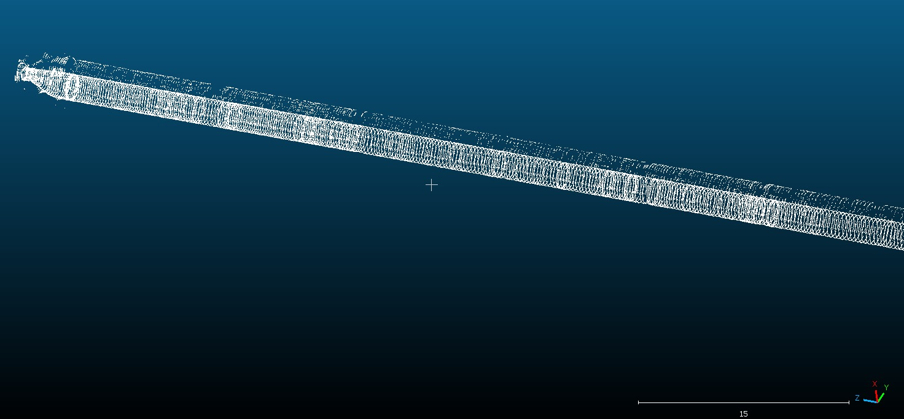

# 3D Point Cloud Mapping with Sensor Fusion

This part of the project focuses on generating and visualizing a 3D point cloud from various sensor inputs. Using synchronized data from sonar, IMU, and Doppler Velocity Log (DVL), a real-time 3D representation of the environment is constructed.

## 🧠 Concept Overview

- **Sensor Fusion:** Combines input from sonar, IMU, DVL, and Cable Counter to track position in 3D space.
- **Point Cloud Generation:** Each data point is transformed into a 3D coordinate based on the sensor readings and estimated position.
- **Visualization:** A point cloud is rendered to represent the shape and structure of the scanned environment, such as a tunnel.

## 📸 Sample Visualization

Below is an example output of the generated 3D point cloud:

> *Visual representation of a scanned tunnel using fused sensor data.*

## 💡 Use Cases

- Subsea tunnel or pipeline inspection
- Autonomous underwater vehicle (AUV) mapping
- Real-time environmental reconstruction

## 🛠 Technologies Used

- Python / C++ (depending on data processing pipeline)
- Open3D or PCL (Point Cloud Library) for visualization
- Sensor APIs for Sonar, IMU, DVL

## 🚀 Next Steps

- Improve filtering and denoising of point cloud
- Real Time Point Clouds ROS-Based

